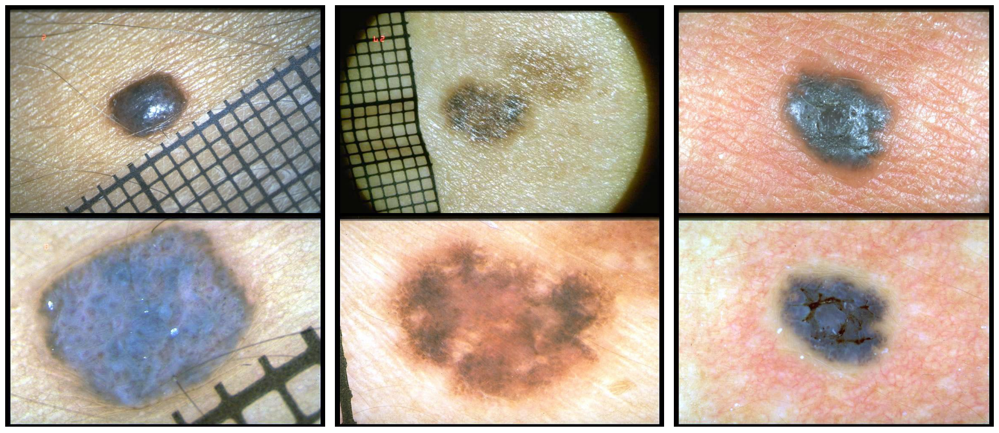

# Derm7pt

Example images of the Derm7pt dataset. The top row shows the inferior modality clinical images and the bottom row shows the corresponding superior modality images of the dermoscopic modality.



Derm7pt is a publicly available dataset of multimodal skin lesions images and can be downloaded from [here](https://github.com/jeremykawahara/derm7pt). We use the same training-validation-testing splits as in the dataset but we remove 8 pairs of images that lack one of the modalities (see the `./labels` folder).

### Requirements

The codes used for the analysis of Derm7pt dataset are implemented mainly using Python 3.7.11, Tensorflow 2.4.1, and Cuda 10.1. The provided conda environment can be set as follows:

```
cd derm7pt
conda env create -f env_derm7pt.yml
conda activate env_derm7pt
```

### Models

1) Run `modality_specific_classifier.ipynb` for evaluating the inferior and superior modality classifiers.

2) Run `guidance_model.ipynb` to map from the latent space of inferior to superior after extracting the latent representations using `latent_representations.ipynb`.

3) Finally, run `guided_model.ipynb` for the proposed guided model, G(I)+I.

4) (Optional) Compare the performance of the guided model with the multimodel model from `multimodal_classifier.ipynb`.
